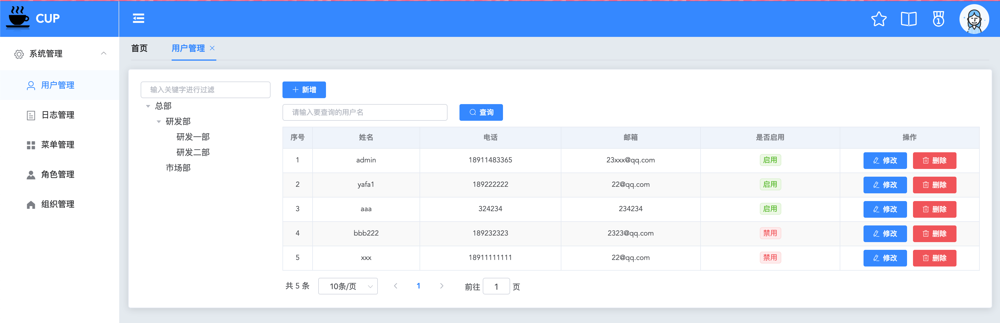
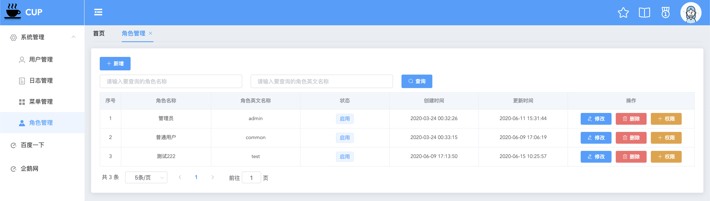
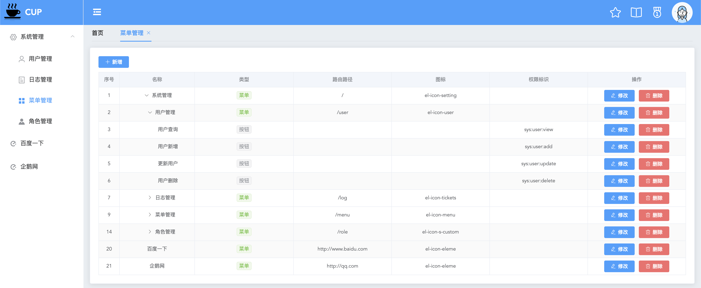
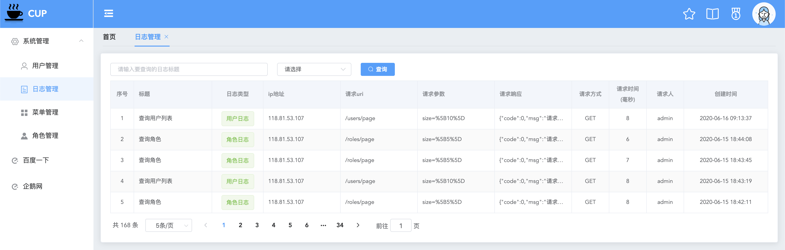

# cup后台管理系统

## 技术栈

基于RBAC权限模型设计，JWT前后端分离

- Spring Boot2.0
- Spring Security
- Mybatis-Plus 2.3.0
- Vue
- jjwt

|技术|版本|
|:---:|:---:|
|Spring Boot|2.1.10.RELEASE|
|Spring Security|2.1.10.RELEASE|
|Mybatis-Plus|2.3.0|
|Vue|2.6.11|
|Vue-cli|4.2.0|
|jjwt|0.10.5|


## 目录结构说明

```bash
cup-vue 	cup前端页面
cup				cup后端
 |--db   	数据库文件
 |--src  	项目源文件
```


## 快速开始

1.初始化数据库
- 执行db/schema.sql
- 执行db/cup.sql

2.启动cup后台
- 启动CupApp.java

3.启动cup前端
- 安装依赖 
```bash
cd /cup-vue
npm install
```
- 启动 
```bash
npm run serve
```

4.访问页面 

http://localhost:9999


## 运行效果










## cup线上演示环境
[cup线上环境](http://49.233.209.183/)


## 项目遇到的难点和问题

### 1.Vue-router报错NavigationDuplicated
- 问题描述：

项目中使用`this.$router.push()`进行跳转的时候，有时候控制台会报 [NavigationDuplicated {_name: "NavigationDuplicated", name: "NavigationDuplicated"}]这个错误

- 问题原因：

Vue-router在3.1之后把$router.push()方法改为了Promise。所以假如没有回调函数，错误信息就会交给全局的路由错误处理，因此就会报上述的错误。

- 解决方案：

写成`router.push('/location').catch(err => {err})`


### 2.菜单配置http链接

- 问题描述

如果菜单的url配置了http链接，例如配置了百度链接，点击菜单跳转的效果就会是`http://localhost:9999/http://www.baidu.com`，这肯定不是我们想要的，我们想要的效果就是将百度的页面展示在项目右侧的内容展示区内

- 解决方案

在`<router-view></router-view`同级下面新增一个`iframe`，然后我们在跳转前判断跳转的url是否包含http，如果包含http就给iframe赋值url，显示iframe隐藏router-view，如果不包含http就显示router-view隐藏iframe


### 3.el-tree回显

- 问题描述

如果我们把选中的菜单id集合返回给前端，el-tree就会全选，其实有些节点中只有几个被选中了，回显是不正确的，我们想要的效果就是没有全选的节点半选

- 解决方案

el-tree的node有一个`isLeaf`属性，是叶子节点就设置选中，不是叶子几点就不选中，这样就达到预期了，具体代码详见Role.vue

```js
res1.data.forEach(menuId => {
  var node = this.$refs.tree.getNode(menuId);
  if(node.isLeaf){
    this.$refs.tree.setChecked(node, true);
  }
});
```

### 4.腾讯云服务器部署

- 问题描述

nginx配置反向代理，结果请求接口没有反应

- 解决方案

大概率是没有配置腾讯云服务器安全组的出站规则，将3001端口添加到出站规则即可